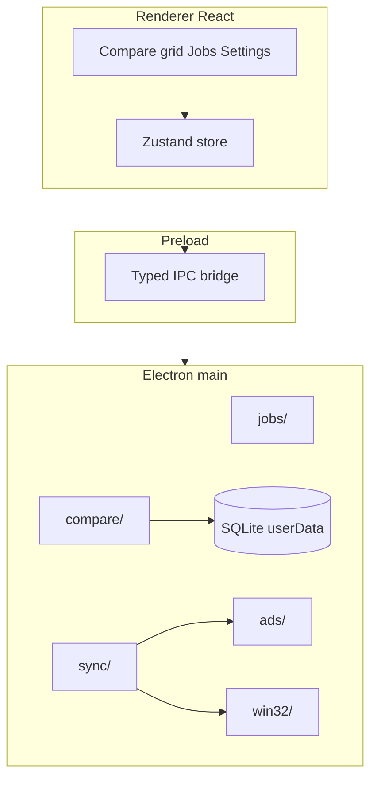

# Architecture

## Process model



| Process | Responsibility |
|---------|----------------|
| **Main** | Filesystem I/O, Win32 ADS, compare/sync engine, SQLite, job load/save |
| **Preload** | Typed `MyFileSyncApi`; no Node in renderer |
| **Renderer** | React UI, Zustand state, no direct `fs` |

## Main modules

```
src/main/
  index.ts              # App bootstrap, window, IPC register
  ui/editContextMenu.ts # Cut/Copy/Paste/Select All on text fields
  ipc/register.ts       # Zod-validated handlers
  jobs/
    store.ts            # Load/save job JSON
    importIni.ts        # BackupMirror INI → JSON
    importFfs.ts        # FreeFileSync .ffs_gui / .ffs_batch → JSON
  compare/
    walk.ts             # Parallel directory traversal
    classify.ts         # Diff categories + ADS manifest diff
    plan.ts             # Action list builder
  sync/
    execute.ts          # Worker pool, progress, cancel
    copy.ts             # CopyFileEx + copyStreams fallback
    delete.ts           # Recycle Bin / permanent
    vss.ts              # Optional snapshot path
    hardlink.ts         # Multi-root hard links
  ads/
    list.ts             # FileStreamInfo enumeration (attributes-only; no $DATA read)
    copyStreams.ts      # Alternate-only replication
  db/
    syncState.ts        # Per-job change DB
  win32/
    attrs.ts            # Read-only detection
    nativeLock.ts       # Serialize koffi calls
```

```
src/shared/
  schemas/              # Zod: job, compare result, IPC
  ipc/                  # Contract + api types
  compare/              # Pure diff/filter helpers
  result.ts             # Result envelope

src/renderer/
  App.tsx
  components/           # CompareGrid, FilterManager, …
  store/                # Zustand
```

## Data flow: Compare → Sync

1. Renderer calls `compare.run({ jobId })`.
2. Main loads job JSON, probes volumes.
3. Parallel walk produces records per side with `$DATA` stats + ADS manifest.
4. Classify merges into `CompareRow[]` with proposed `SyncAction`.
5. Renderer displays rows; user toggles includes.
6. Renderer calls `sync.run({ jobId, rowIds? })`.
7. Main executes actions via worker pool; reports progress on `sync:event`.
8. Two-way jobs update SQLite sync state.

## ADS integration

All NTFS fidelity flows through `ads/` + `sync/copy.ts`:

- **Never** use Node `createReadStream`→`createWriteStream` alone for NTFS→NTFS file replication (drops ADS on large files).
- Prefer **`CopyFileEx`** / **`CopyFileW`** for whole-file copy including alternates.
- Fallback: copy `$DATA` then `copyStreams`.

See [ADS_SYNC.md](ADS_SYNC.md).

## SQLite

| Database | Path |
|----------|------|
| Sync state | `userData/sync-jobs/{jobId}.db` |

Schema details: [COMPARE_AND_SYNC.md](COMPARE_AND_SYNC.md), [PROJECT_FORMAT.md](PROJECT_FORMAT.md).

## IPC pattern

```typescript
type Result<T> = { ok: true; value: T } | { ok: false; error: { code: string; message: string; hint?: string } }
```

Full channel list: [IPC_CONTRACT.md](IPC_CONTRACT.md).

## Testing

| Layer | Tests |
|-------|-------|
| `shared/compare/*` | Vitest pure functions |
| `ads/paths.ts` | Vitest without Win32 |
| Integration | NTFS fixture folder; Windows CI |
| INI import | Fixture INI files |
