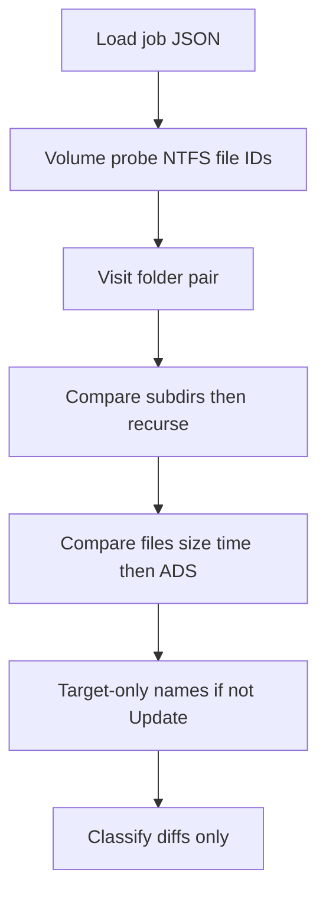
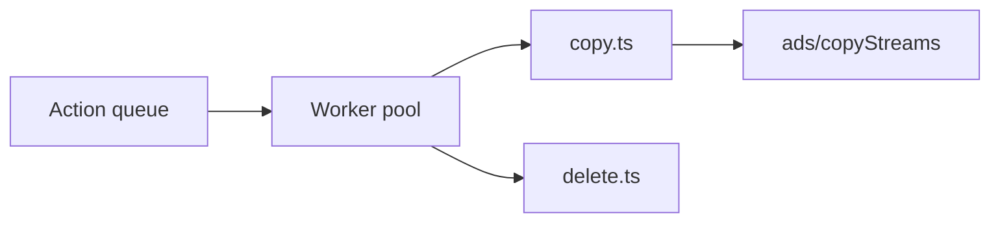

# Compare and sync engine

## Sync variants

| Variant | Config | Behavior |
|---------|--------|----------|
| **Mirror** | `mirror` | Left is source of truth. Create/update/delete on right until exact match (including ADS manifests). |
| **Update** | `update` | Copy new/changed left → right. **No deletes** on right from source deletions. |
| **TwoWay** | `twoWay` | Uses sync DB; propagate creates/updates/deletes by rules; newer mtime wins for conflicts. |
| **Automatic** | `automatic` | BackupMirror Auto: newer timestamp wins; items only on right copied to left; merge ADS both ways. |

### FreeFileSync “changes” vs “differences”

**Update** uses **difference compare** (BackupMirror-style): left/right presence and metadata. Two-way jobs also use the sync DB for change-based compare (create vs delete on source).

## Compare pipeline

BackupMirror `GetFiles`: one source folder against the matching target folder. Compare `$DATA`, then ADS if size and time already match, then the next file. Recurse. No two-tree merge.



### Walk (`src/main/compare/getFiles.ts`)

- Input: pair roots, filters (include/exclude globs).
- Output: **diff** rows streamed to a JSONL store (never a giant in-memory array). Equals are counted only.
- A folder missing on the other side is **one** Create or Delete. Children are not listed; sync copies or removes the tree (filters applied during copy).
- File-level diffs are one row each. The grid pages from disk.
- Per folder: source directories, source files, then target-only names.
- Skip: `$…` segments and `RECYCLER` (BackupMirror `\$` / `RECYCLER`).
- Symlinks: not followed. Junctions are followed (with a cycle guard).

### SideRecord

```typescript
type SideRecord = {
  relPath: string
  isDir: boolean
  dataSize: number
  mtimeMs: number
  primaryHash?: string
  adsManifest: AdsManifest
  fileId?: string  // BY_HANDLE_FILE_INFORMATION when available
}
```

### Classification categories

| Category | Meaning |
|----------|---------|
| `equal` | No sync needed |
| `leftOnly` | Create on right (mirror/update) |
| `rightOnly` | Delete on right (mirror) or create on left (automatic) |
| `leftNewer` | Copy left → right |
| `rightNewer` | Copy right → left (automatic / two-way) |
| `contentDiff` | Hash differs |
| `adsDiff` | `$DATA` equal, manifests differ |
| `moveCandidate` | Pair with remove+add same hash/size/manifest |

### SyncAction types

| Action | Description |
|--------|-------------|
| `Create` | New file/dir on target |
| `Update` | Replace `$DATA` + sync ADS |
| `UpdateStreamsOnly` | Patch ADS only |
| `Delete` | Remove on target |
| `Move` | Same volume rename on target |
| `Rename` | Path change detected |
| `Link` | Create hard link (multi-root jobs) |
| `Skip` | User excluded or filtered |

## Move/rename detection

**Sync DB:** FreeFileSync-style — file ID + last-run state.

**Hash / ADS pairing (BackupMirror-style):**

1. Collect `Delete` + `Create` pairs in same job run.
2. Match when: same primary hash, same size, **identical ADS name list** (order-independent).
3. Collapse to `Move`/`Rename`; remove redundant child actions for folder moves.

## Fast folder compare

When `compare.fastFolderCompare` && `ads.writeCacheToAds`:

1. Read folder aggregate ADS on left/right directory hosts.
2. If `FileCount`, `FolderCount`, `FileSize`, … all match, skip recursion (BackupMirror `GetFilesFast`).
3. On mismatch, full walk subtree.

Aggregate stream names (BackupMirror parity):

- `FileCount`, `FolderCount`, `FileTotCount`, `FolderTotCount`, `FileSize`, `FolderSize`

## Execute pipeline



- Order: **creates before updates before deletes** within same directory depth where possible; deletes last for mirror (children before parents on delete — post-order).
- `parallelism.copyPerDevice`: max concurrent copies per volume root (FFS-style).
- Progress: `{ phase, done, total, currentPath, bytes, etaMs }` events.
- Cancel: cooperative flag checked between actions.

### VSS

When copy fails with sharing violation and `vss.enabled`:

1. Snapshot source volume via VSS API.
2. Copy from shadow path with `CopyFileEx`.
3. Release snapshot.

Port concept from BackupMirror AlphaVSS usage.

### Verify

When `behavior.verifyAfterCopy`:

- Re-hash `$DATA` on dest; compare manifests (sizes; optional stream hashes).

## SQLite sync database

Path: `userData/sync-jobs/{jobId}.db`

### Table `file_state`

| Column | Type | Notes |
|--------|------|-------|
| `pair_id` | TEXT | Folder pair |
| `rel_path` | TEXT | Normalized relative path |
| `side` | TEXT | `left` \| `right` |
| `size` | INTEGER | `$DATA` size |
| `mtime_ms` | INTEGER | |
| `file_id` | TEXT | Nullable |
| `primary_hash` | TEXT | Nullable |
| `ads_manifest_json` | TEXT | |
| `last_sync_generation` | INTEGER | Increment each successful sync |

### Table `sync_run`

Run metadata for logs and incremental compare.

Enables:

- Two-way change detection
- Move detection without hash pairing
- “What changed since last run” report

## Filters

| Type | Behavior |
|------|----------|
| Exclude glob | `*.tmp`, `thumbs.db`, `!Thumbnails` (any depth relative to the pair root; `!` is literal) |
| Exclude this path | `/!Thumbnails` (root instance only) or `models/!Thumbnails` (that relative path only) |
| Include glob | Optional allow-list |
| Attributes (archive-only) | `behavior.archiveFlagScanOnly` |

BackupMirror used **exact** filename/path only; MyFileSync uses **minimatch** or equivalent for globs.

## Error handling

Map to `AppError` with codes:

| Code | Example |
|------|---------|
| `io` | Generic failure |
| `not-allowed` | Read-only folder |
| `busy` | File locked (suggest VSS) |
| `validation` | Invalid job |
| `cancelled` | User cancel |

Plain-language messages per D11 — no raw `EPERM` to users.

## Performance targets

| Scenario | Target |
|----------|--------|
| 100k files, no ADS | Within 120% of FreeFileSync compare (local SSD) |
| ADS manifest | Always listed and compared (name + size), independent of size/time |
| Parallel copy | Saturate network card on LAN/NAS when `copyPerDevice` tuned |

## Related

- [ADS_SYNC.md](ADS_SYNC.md)
- [PROJECT_FORMAT.md](PROJECT_FORMAT.md)
- [FREEFILESYNC_PARITY.md](FREEFILESYNC_PARITY.md)
