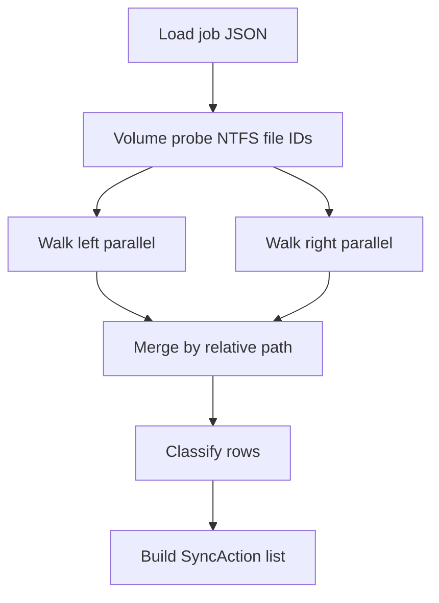
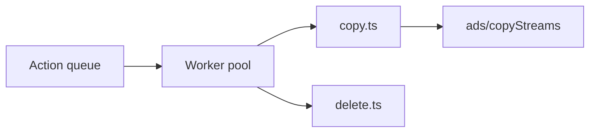

# Compare and sync engine

## Sync variants

| Variant | Config | Behavior |
|---------|--------|----------|
| **Mirror** | `mirror` | Left is source of truth. Create/update/delete on right until exact match (including ADS manifests). |
| **Update** | `update` | Copy new/changed left → right. **No deletes** on right from source deletions. |
| **TwoWay** | `twoWay` | Phase 2. Uses sync DB; propagate creates/updates/deletes by rules; newer mtime wins for conflicts. |
| **Automatic** | `automatic` | BackupMirror Auto: newer timestamp wins; items only on right copied to left; merge ADS both ways. |

### FreeFileSync “changes” vs “differences”

Phase 1 **Update** uses **difference compare** (BackupMirror-style): left/right presence and metadata.

Phase 2 **Update** gains **change-based** compare via sync DB (FFS 13+ semantics): distinguish create vs delete on source for backup scenarios (phone photos).

## Compare pipeline



### Walk

- Input: absolute root, filters (include/exclude globs), `compareWorkers` count.
- Output: `Map<relPath, SideRecord>`.
- Skip: reparse points (optional follow junction setting — default follow for BackupMirror parity).
- Symlinks: default **not** followed (BackupMirror skipped symlinks in practice via directory check).

### SideRecord

```typescript
type SideRecord = {
  relPath: string
  isDir: boolean
  dataSize: number
  mtimeMs: number
  primaryHash?: string
  adsManifest: AdsManifest
  fileId?: string  // BY_HANDLE_FILE_INFORMATION when available
}
```

### Classification categories

| Category | Meaning |
|----------|---------|
| `equal` | No sync needed |
| `leftOnly` | Create on right (mirror/update) |
| `rightOnly` | Delete on right (mirror) or create on left (automatic) |
| `leftNewer` | Copy left → right |
| `rightNewer` | Copy right → left (automatic / two-way) |
| `contentDiff` | Hash differs |
| `adsDiff` | `$DATA` equal, manifests differ |
| `moveCandidate` | Pair with remove+add same hash/size/manifest |

### SyncAction types

| Action | Description |
|--------|-------------|
| `Create` | New file/dir on target |
| `Update` | Replace `$DATA` + sync ADS |
| `UpdateStreamsOnly` | Patch ADS only |
| `Delete` | Remove on target |
| `Move` | Same volume rename on target |
| `Rename` | Path change detected |
| `Link` | Create hard link (multi-root jobs, Phase 1.5) |
| `Skip` | User excluded or filtered |

## Move/rename detection

**Phase 2 (DB):** FreeFileSync-style — file ID + sync DB from last run.

**Phase 1.5 (BackupMirror fallback):**

1. Collect `Delete` + `Create` pairs in same job run.
2. Match when: same primary hash, same size, **identical ADS name list** (order-independent).
3. Collapse to `Move`/`Rename`; remove redundant child actions for folder moves.

## Fast folder compare

When `compare.fastFolderCompare` && `ads.writeCacheToAds`:

1. Read folder aggregate ADS on left/right directory hosts.
2. If `FileCount`, `FolderCount`, `FileSize`, … all match, skip recursion (BackupMirror `GetFilesFast`).
3. On mismatch, full walk subtree.

Aggregate stream names (BackupMirror parity):

- `FileCount`, `FolderCount`, `FileTotCount`, `FolderTotCount`, `FileSize`, `FolderSize`

## Execute pipeline



- Order: **creates before updates before deletes** within same directory depth where possible; deletes last for mirror (children before parents on delete — post-order).
- `parallelism.copyPerDevice`: max concurrent copies per volume root (FFS-style).
- Progress: `{ phase, done, total, currentPath, bytes, etaMs }` events.
- Cancel: cooperative flag checked between actions.

### VSS (Phase 1.5)

When copy fails with sharing violation and `vss.enabled`:

1. Snapshot source volume via VSS API.
2. Copy from shadow path with `CopyFileEx`.
3. Release snapshot.

Port concept from BackupMirror AlphaVSS usage.

### Verify

When `behavior.verifyAfterCopy`:

- Re-hash `$DATA` on dest; compare manifests (sizes; optional stream hashes).

## SQLite sync database (Phase 2)

Path: `userData/sync-jobs/{jobId}.db`

### Table `file_state`

| Column | Type | Notes |
|--------|------|-------|
| `pair_id` | TEXT | Folder pair |
| `rel_path` | TEXT | Normalized relative path |
| `side` | TEXT | `left` \| `right` |
| `size` | INTEGER | `$DATA` size |
| `mtime_ms` | INTEGER | |
| `file_id` | TEXT | Nullable |
| `primary_hash` | TEXT | Nullable |
| `ads_manifest_json` | TEXT | |
| `last_sync_generation` | INTEGER | Increment each successful sync |

### Table `sync_run`

Run metadata for logs and incremental compare.

Enables:

- Two-way change detection
- Move detection without hash pairing
- “What changed since last run” report

## Filters

| Type | Phase 1 |
|------|---------|
| Exclude glob | `*.tmp`, `thumbs.db` |
| Include glob | Optional allow-list |
| Size / date | Phase 2 |
| Attributes (archive-only) | Phase 1.5 (`UseArchiveFlag` parity) |

BackupMirror used **exact** filename/path only; MyFileSync uses **minimatch** or equivalent for globs.

## Error handling

Map to `AppError` with codes:

| Code | Example |
|------|---------|
| `io` | Generic failure |
| `not-allowed` | Read-only folder |
| `busy` | File locked (suggest VSS) |
| `validation` | Invalid job |
| `cancelled` | User cancel |

Plain-language messages per D11 — no raw `EPERM` to users.

## Performance targets

| Scenario | Target |
|----------|--------|
| 100k files, no ADS | Within 120% of FreeFileSync compare (local SSD) |
| ADS manifest | Lazy: list streams only when size/time differ OR always if job.ads.strict |
| Parallel copy | Saturate network card on LAN/NAS when `copyPerDevice` tuned |

## Related

- [ADS_SYNC.md](ADS_SYNC.md)
- [PROJECT_FORMAT.md](PROJECT_FORMAT.md)
- [FREEFILESYNC_PARITY.md](FREEFILESYNC_PARITY.md)
