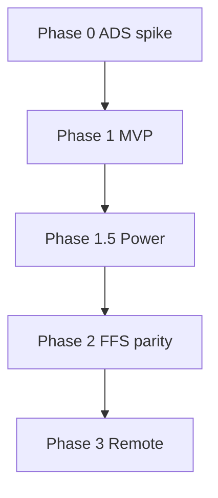

# Implementation plan

Phased checklist. Mark items done in CHANGELOG as shipped.

## Phase 0 — Scaffold and ADS spike

**Goal:** Runnable Electron shell + proven ADS list/copy on NTFS fixture.

- [x] `npm init` — electron-vite, React 19, TS strict, Vitest, ESLint, Prettier, Zod, Zustand
- [x] Folder structure per [ARCHITECTURE.md](ARCHITECTURE.md)
- [x] Empty window + status bar
- [x] `shared/result.ts`, `shared/ads/paths.ts` + unit tests
- [x] `main/ads/list.ts` — FindFirstStreamW listStreams (koffi)
- [x] `main/ads/copyStreams.ts` — copy alternate between two test files
- [x] Manual test doc in `docs/TESTING.md`
- [x] VSS library spike notes in DECISIONS deferred section

**Exit criteria:** List streams on `test/fixtures`; copy file with 2 ADS to new path; manifests match.

## Phase 1 — MVP compare + sync

**Goal:** Replace BackupMirror for daily mirror/update on local NTFS pairs.

### 1a Engine

- [x] `jobSchema` Zod + load/save JSON
- [x] `compare/walk.ts` — parallel traversal, filters (glob)
- [x] `compare/classify.ts` — categories + ADS manifest diff
- [x] `compare/plan.ts` — SyncAction list
- [x] `sync/copy.ts` — CopyFileEx primary path
- [x] `sync/delete.ts` — Recycle Bin default
- [x] `sync/execute.ts` — worker pool, cancel, progress events
- [x] Variants: **mirror**, **update**, **automatic**
- [x] Read-only folder detection + plain errors (D11) — attrs module + messaging

### 1b UI

- [x] Jobs rail + job editor
- [x] Compare grid + filters (virtualization deferred)
- [x] ADS badge column + row detail stream preview
- [x] Sync confirm when deletes &gt; 0
- [x] Run log tab (basic)

### 1c Import / polish

- [x] `job/importIni.ts` per [BACKUPMIRROR_MIGRATION.md](BACKUPMIRROR_MIGRATION.md)
- [x] Settings export/import
- [ ] Acceptance tests from [PRODUCT_SPEC.md](PRODUCT_SPEC.md) US-1–US-5 (manual)

**Exit criteria:** Mirror fixture → backup including ADS; INI sample imports; no MyFileExplorer imports.

## Phase 1.5 — BackupMirror power features

- [x] `ads.writeCacheToAds` — MD5 stream on hash
- [x] Fast folder compare via aggregate ADS
- [x] Move/rename detection (hash + ADS names)
- [x] VSS locked-file copy (stub / hint)
- [x] Hard links — multi-root jobs
- [x] `UseArchiveFlag` scan mode
- [x] Verify after copy
- [x] Stream preview in detail dialog

## Phase 2 — FreeFileSync parity layer

- [x] SQLite sync DB + two-way variant
- [x] Change-based update compare (sync DB)
- [ ] Custom sync rules UI (schema only; editor deferred)
- [x] Versioning folder
- [x] Batch JSON + CLI: `MyFileSync.exe --run job.json`
- [x] RealTimeSync: watch folders, debounce, spawn batch
- [x] Parallelism settings per device in UI
- [x] Items from [FREEFILESYNC_PARITY.md](FREEFILESYNC_PARITY.md) marked **Must** for Phase 2

## Phase 3 — Remote (optional)

- [x] SFTP provider (primary stream only; compare wiring partial)
- [x] UNC ADS preflight + warnings
- [x] Sidecar ADS policy design for non-NTFS (DECISIONS.md)

## Ongoing

- [x] Windows CI (`npm run check`)
- [x] NSIS installer ([BUILD.md](BUILD.md))
- [x] Update [FREEFILESYNC_PARITY.md](FREEFILESYNC_PARITY.md) status column as features ship

## Dependency graph

## Risk register

| Risk | Mitigation | Owner phase |
|------|------------|-------------|
| CopyFileEx unavailable in koffi | Fallback copyStreams | 0 |
| better-sqlite3 native build | sql.js fallback | 2 |
| Scope creep | FREEFILESYNC_PARITY.md tiers | all |
| ADS on SMB fails | Preflight + message | 1 |

## Related

- [PLAN.md](../PLAN.md)
- [PRODUCT_SPEC.md](PRODUCT_SPEC.md)
